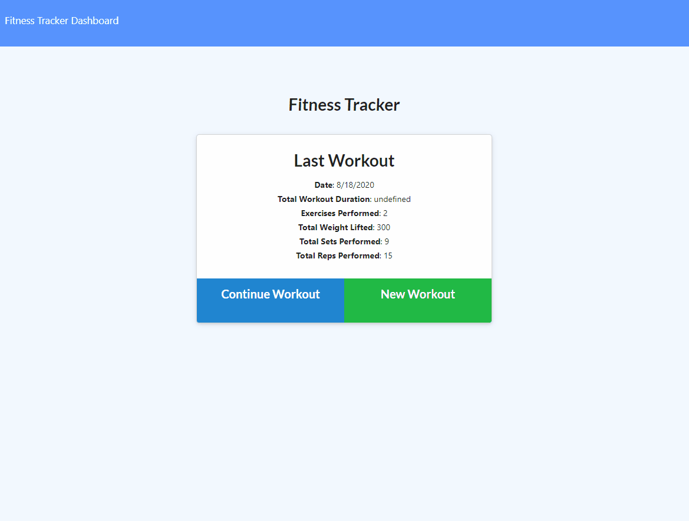
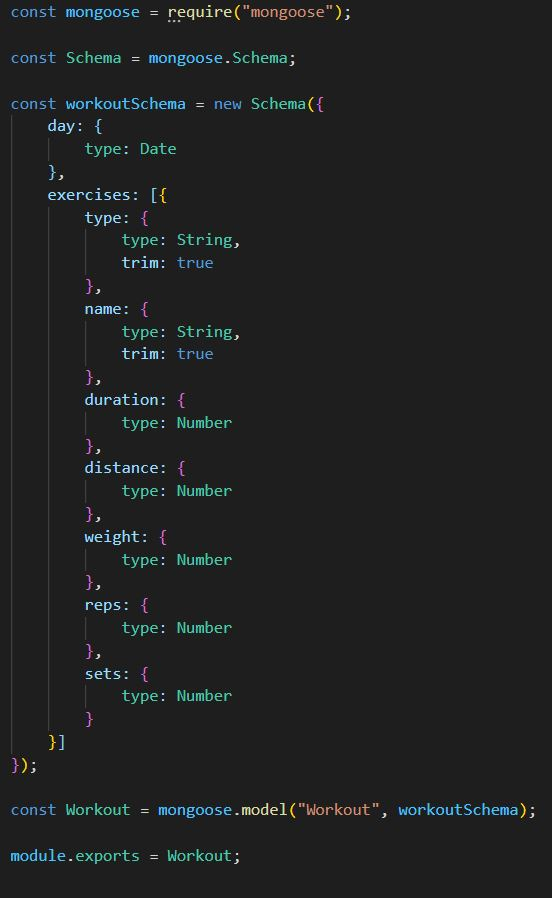
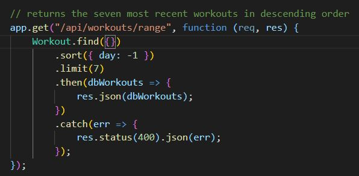

# hw-17-nosql
Homework Week 17: NoSQL

## Description

This week's homework was an introduction to mongoDB, and its ODM, mongoose. Mongoose allowed us
to create models for making server calls and structuring out tables, very similarly to how
sequilize did for MySQL.

## Usage

To use the app, the user simply chooses to create a new workout, or to add an exercise to the
existing most recent workout. Once the information is added, they can choose to accept and add
another or to go back to the main page. When the user clicks on the dashboard link, they are
shown some graphs of the data for the last 7 workouts they completed. Here is a quick gif of
the application running:

## Code

The biggest new code we had to learn had to deal with mongoDB and its ODM, mongoose. However,
mongo data feels very familiar as it is basically JSON data. An important part of mongoose is
creating models for documents. Here is an example of the workout model:

Next, we needed to create API routes that accessed the data saved into the database. Here is
a quick example of the range api route, which returned the most recent 7 workouts:

